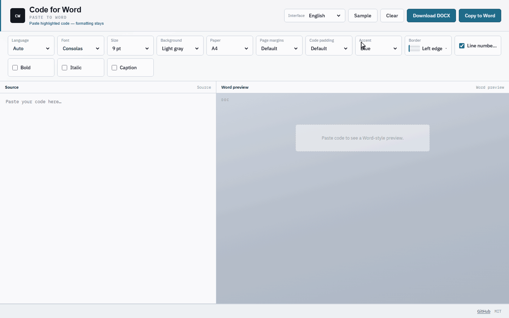

# 码文 · Code for Word

[English](./README.md) | **中文**

<p align="center">
  
</p>

把高亮代码贴进 Word，颜色和中文尽量保持正常。

## 怎么用

### 1）网页版（不用安装）

**打开网页版：** https://l00plegend.github.io/code-for-word/

源码镜像：[Gitee · loopisme/code-for-word](https://gitee.com/loopisme/code-for-word)（与 GitHub 同步；网页版只维护上述一个地址，避免双站过期/挂掉）

- 粘贴代码 → 调选项 → **下载 DOCX**（网页上最稳）
- 也可以点 **复制到 Word**，但浏览器粘贴效果不稳定；要高质量粘贴请用 Windows 桌面版

### 2）Windows 桌面版（粘贴效果最好）

1. 在 [Releases](https://github.com/L00PLeGeNd/code-for-word/releases/latest) 下载 `CodeForWord-Setup-*.exe`
2. 安装后从开始菜单打开 **Code for Word**
3. 粘贴代码 → **复制到 Word** → 到 Word 里 `Ctrl+V`（粘贴选项尽量选 **保留源格式**）

若出现 SmartScreen「未知发布者」，点 **更多信息 → 仍要运行**（目前安装包未做代码签名）。

关掉窗口会进系统托盘，不会退出。

## 开发

```bash
git clone https://github.com/L00PLeGeNd/code-for-word.git
cd code-for-word
npm install
npm run dev
npm test
npm run dist:win
```

## 许可证

MIT
